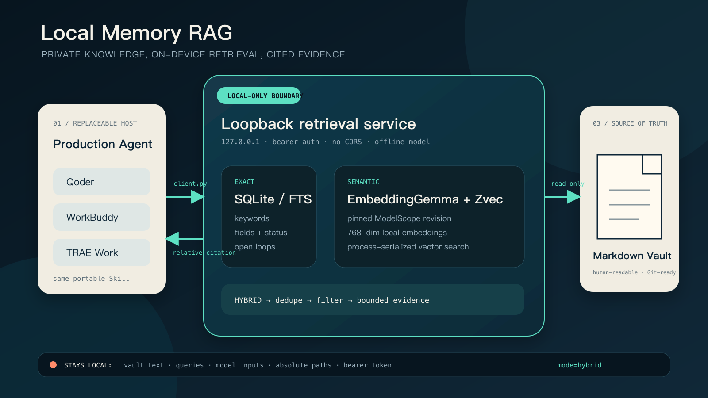
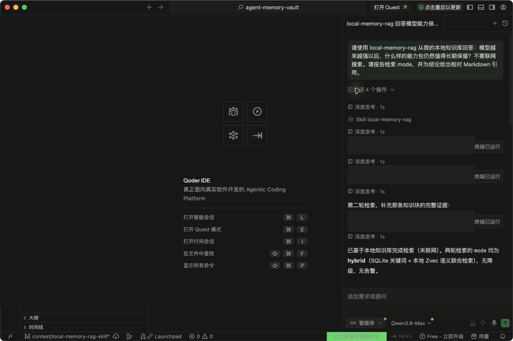
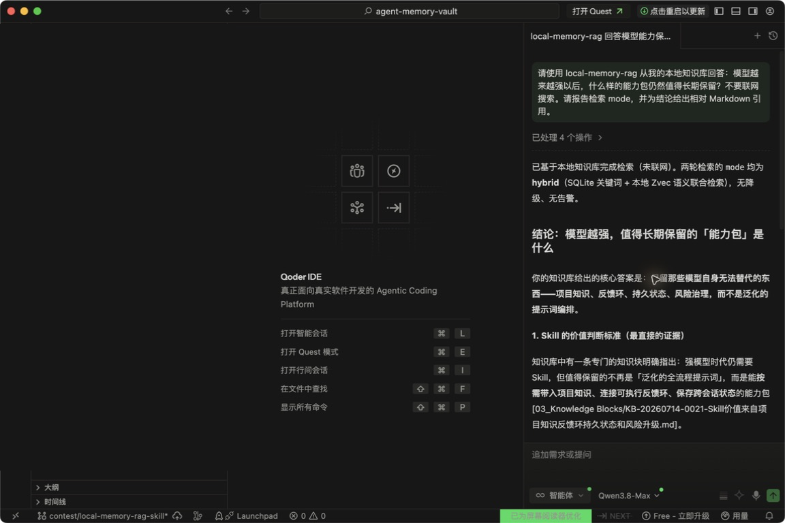

# 不上传私人笔记，也能让生产力 Agent 记得你：Local Memory RAG Skill 实战

> 本文为 Production AI Skills 大赛投稿草稿。以下宿主证据来自 2026-08-11 的真实 Qoder 调用；截图仅遮挡本机路径，未改动 Skill 名称、调用状态、检索模式或引用。

我有一个长期维护的 Markdown / Obsidian 知识库。里面不仅是收藏，还有项目决策、做事流程、失败教训和经过二次加工的知识块。问题是：每次打开一个新的生产力 Agent，会话能力很强，但它不知道这些过去；如果把整库上传到云端 RAG，又会带来隐私、成本和供应商绑定。

Local Memory RAG 的目标很具体：**让 Qoder、WorkBuddy、TRAE Work 等 Agent 通过一个可复用 Skill 检索本机私人知识库；模型、索引、查询与原文都留在本机，回答只携带最小证据和相对路径引用。**

## 开源基础与本次开发边界

本作品以 MIT 许可的 Agent Memory Vault 开源代码为基础进行二次开发。比赛版本由 siuserxiaowei 开发和维护，新增内容包括生产力 Agent Skill 封装、loopback 鉴权服务、EmbeddingGemma + Zvec 本地混合检索接入、查询与路径隐私加固、自包含发布包、Qoder 真实宿主验证以及完整测试体系。底层开源代码与本次新增部分共同遵循包内 MIT 许可；公开材料只保留项目级来源与贡献说明，不展示第三方个人身份信息。

## 一、它解决的不是“搜索”，而是可信的个人上下文

普通全文搜索在知道关键词时很好用，但个人记忆常常是“记得意思，不记得原词”。例如我问：

> 模型越来越强以后，什么样的能力包仍然值得长期保留？

笔记标题里写的却是：

> Skill 价值来自项目知识、反馈环、持久状态和风险升级

只依赖字面搜索很容易被 15,000 多篇资料中的噪声淹没。语义检索能找到意思相近的知识块，但单独依赖向量又缺少稳定字段、状态过滤和精确路径。于是项目采用混合检索：

- Markdown 是唯一长期事实源，人可以直接编辑、diff 和 Git 管理。
- SQLite/FTS 负责关键词、字段、状态和精确过滤。
- 本地 EmbeddingGemma 把查询与知识块编码为 768 维向量。
- Zvec 负责语义候选召回。
- 统一搜索层并行取回、去重、过滤，再向 Agent 返回引用和有限片段。



这套设计把“Agent 大脑”和“私人记忆”解耦：宿主可以换，知识库不用迁移；向量索引损坏可以重建，Markdown 真源仍在。

## 二、为什么采用 loopback Client/Server

比赛官方推荐 Client/Server 部署，本项目也使用这一结构：常驻服务绑定 `127.0.0.1`，Skill 只调用短生命周期客户端。

```text
Production Agent
  -> Skill / client.py
  -> Bearer auth @ 127.0.0.1
  -> Local Memory RAG service
  -> SQLite + EmbeddingGemma + Zvec
  -> relative citation + bounded snippet
```

这样有三个好处：

1. 宿主接入很薄。Qoder、WorkBuddy、TRAE Work 使用同一个 Skill 目录和命令，不需要各自理解索引细节。
2. 安全边界集中。服务拒绝 `0.0.0.0`、局域网地址和非回环主机；所有接口要求 Bearer Token。
3. 模型与索引生命周期独立。Agent 会话结束不影响本地检索服务，后续可以继续做模型常驻和设备优化。

发布 zip 是自包含的：SQLite 索引器、混合搜索运行时、Zvec 适配器、服务端、客户端和 Windows 固定入口 `scripts\\run.ps1` 都在包内，不要求评委再克隆外部仓库。配置、建库、启动与检索统一由 `run.ps1`（macOS/Linux 对应 `run.sh`）管理。客户端先检查健康状态，再搜索：

```bash
python3 skills/local-memory-rag/scripts/client.py health --json
python3 skills/local-memory-rag/scripts/client.py search \
  "模型越来越强以后，什么样的能力包仍然值得长期保留？" \
  --limit 5 --json
```

成功语义检索必须明确返回 `mode=hybrid`。如果本地模型或 Zvec 不可用，系统会返回 `keyword_fallback`，不会把关键词兜底包装成“RAG 已成功”。这个标记对 Agent 很重要：它知道何时应该提示召回能力下降。

## 三、固定模型快照，而不是依赖会漂移的缓存

Embedding 模型使用 `google/embeddinggemma-300m`。Hugging Face 源需要许可访问，而 ModelScope 上存在公开可访问镜像，因此下载器固定到 revision：

```text
480ee9b0e4761c35cf4f8295236b7b01b256b8cf
```

模型共 17 个文件、约 1.27 GB。下载器实现了：

- `.partial` 断点续传；
- 每文件大小与 SHA-256 校验；
- 下载完成后的原子替换；
- 权限为 `0600` 的 `model-manifest.json`；
- 明确记录 ModelScope 来源、revision 与 Gemma Terms of Use。

生产配置使用本地模型绝对路径并设置 `require_local_model=true`。每次检索子进程还会清除代理变量，强制：

```text
HF_HUB_OFFLINE=1
TRANSFORMERS_OFFLINE=1
```

实测在该环境中模型能成功加载，输出 768 维有限向量。这能防止演示现场因缓存被清理或网络波动而突然访问远端。

## 四、隐私不是一句“本地运行”

为了让“资料不出机”可验证，我把边界拆成几个具体约束。

### 1. 网络边界

服务只接受 loopback；浏览器跨域头不开放；客户端默认地址固定为 `http://127.0.0.1:8765`。

### 2. 访问边界

Token 和私有配置必须是 `0600`。没有 Token 的搜索返回 401；服务端用常量时间比较验证凭证。

### 3. 输出边界

内部索引保存真实路径，但公开 API 删除 `path` 和内部调试字段，只返回 `citation`。相对路径包含绝对路径或 `..` 时直接拒绝。

### 4. 进程边界

很多“本地工具”仍会把私人查询放进命令行参数，从而暴露在进程列表或诊断工具中。Local Memory RAG 的两层子进程都改用 `--query-stdin`，搜索日志只保留查询哈希和长度，不保存原文。

### 5. 失败边界

未知字段、过长请求、非 JSON、非法 filter 和非本地模型都会明确失败。系统不因追求“总有答案”而静默放宽隐私条件。

## 五、从真实知识库得到的结果

本次验证使用真实私人 Markdown 库建立派生索引，但仓库只公开模板、代码和假示例：

- SQLite 索引：15,446 篇 Markdown；
- open loops：155；
- 首轮语义索引：26 个高密度 Knowledge Blocks；
- 向量 chunk：54；
- 模型维度：768。

首轮没有把 15,000 多篇资料全部向量化，而是先验证 26 个经过蒸馏的高信号知识块。这是有意的生产策略：向量化更多不等于召回更好；未经加工的收藏往往只会放大噪声。

对下面的语义改写查询：

> 模型越来越强以后，什么样的能力包仍然值得长期保留？

首条结果命中：

```text
03_Knowledge Blocks/
KB-20260714-0021-Skill价值来自项目知识反馈环持久状态和风险升级.md
```

该结果来源包含 `zvec`，检索模式为 `hybrid`。它支持的结论是：强模型时代值得长期保留的 Skill，不是泛化全流程提示词，而是能带入项目知识、连接可执行反馈环、保存跨会话状态，或在高风险场景触发专业审查的窄能力包。

并发验证还暴露过一次真实工程问题：Zvec 以读写方式打开 collection，两个查询同时进入时，其中一个可能因集合锁失败而降级。修复方式不是忽略警告，而是先写失败测试，再把所有 Zvec 查询纳入跨进程独占锁。修复后两个并发请求均返回 `hybrid`。

在 Apple M4（10 核）、24 GB 内存、macOS 15.7.1 上，我让服务保持启动，先预热一次，再连续执行 5 次完整 HTTP 混合检索。端到端耗时为 3.77–9.47 秒，中位数 4.83 秒，5 次都返回 `hybrid` 并命中同一相对引用。这个结果说明当前版本已适合低频个人知识召回，但延迟仍有明显优化空间；模型常驻、OpenVINO 和量化应以这组基线为起点，而不是提前声称已经加速。

## 六、接入生产力 Agent

Skill 安装到宿主后，Agent 只需要遵循 `SKILL.md`：先 health，再调用客户端搜索，读取 `mode`，最后只依据返回证据作答并使用相对引用。

推荐验证提示：

> 请使用 local-memory-rag 从我的本地知识库回答：模型越来越强以后，什么样的能力包仍然值得长期保留？不要联网搜索。请报告检索 mode，并为结论给出相对 Markdown 引用。

Qoder 实际识别了 `Skill local-memory-rag`，依次调用健康检查和两次本地搜索。操作链中的命令路径已脱敏，但 `Skill` 名称、三次“终端已运行”和最终 `hybrid` 状态保留：



最终回答明确显示两轮检索均为 `hybrid`，并引用目标 Knowledge Block 的相对 Markdown 路径：



Qoder 日志同时记录了本次 Agent 请求的三次 `run_in_terminal` 工具调用，并以 `chat_finish:success:200` 完成。整个过程没有使用浏览器或云端搜索工具；Local Memory RAG 服务仍为 `loopback-only`，嵌入模型保持离线。

## 七、Hybrid AI 的取舍

个人知识库是典型的端侧任务：高频、隐私敏感、个性化强，而且输入规模会持续增长。把检索下沉到 AI PC，可以减少隐私暴露、云端流量和每次上传上下文的成本。

但“全本地”不代表所有环节都必须封闭。一个现实的 Hybrid AI 工作流可以是：云端 Agent 负责复杂规划或通用推理；本地 Skill 只处理私人资料检索；Agent 得到的是最小必要证据，而不是整库。这个边界比“所有数据都上云”或“所有推理都本地”更实用。

当前版本使用 PyTorch / SentenceTransformers CPU 路径，OpenVINO、GPU、NPU 优化仍是下一阶段，不应提前声称已经具备。比赛规则将 OpenVINO 写为推荐项；若继续优化，优先测量冷启动、热查询延迟、内存占用和召回质量，再决定是否导出 OpenVINO IR 与量化，而不是只为技术标签改框架。

## 八、复现与边界

公开仓库提供：

- Skill 的 `SKILL.md`、`info.json`、`meta.json`；
- loopback 服务、客户端、私有配置脚本和固定模型下载器；
- SQLite + Zvec 混合检索运行时；
- Windows 固定 `run.ps1`、统一配置/建库/启动入口与包内测试；
- 单元、HTTP 集成、隐私与并发回归测试；
- 80% 分支覆盖率质量门和确定性、隐私检查的 Skill 打包器；
- 宿主接入和离线验证说明。

打包测试会把 zip 解压进一个临时目录，创建临时 Markdown，独立完成配置、SQLite 建库、loopback 服务启动、健康检查和关键词检索。这个验收不借用外部 `agent-memory-vault` 克隆。Windows 锁路径已实现 `msvcrt` 回归测试，但当前真实宿主验证仍来自 macOS 上的 Qoder；不把代码级兼容扩大成已完成真实 Windows 硬件验证。

仓库不会提供私人 vault、模型权重、Token、SQLite 和向量索引。复现者需要使用自己的 Markdown 目录，并遵守 Gemma Terms of Use。

Local Memory RAG 想证明的是一件朴素的事：生产力 Agent 不需要拥有你的全部资料，仍然可以在需要时从本机取回可核对的个人上下文。模型可以替换，宿主可以替换；只要 Markdown 真源、隐私边界和证据引用还在，这套个人记忆就不会被某一次会话或某一个平台锁住。
